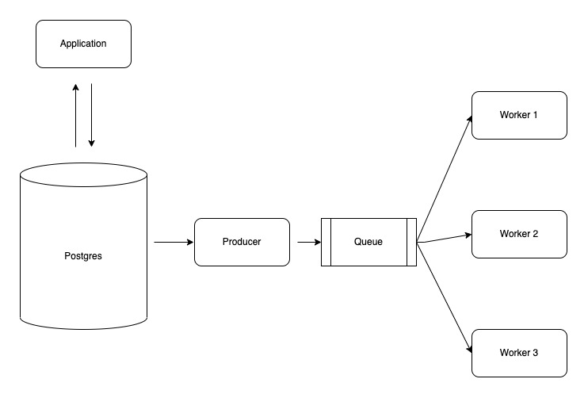

# PGEvents

*Note: This project is not ready for production yet, but it will be very soon. If you're interested in contributing,
send us a note at siva@fylehq.com*

## Introduction

This is a utility to generate table events from Postgres using logical replication and push it to RabbitMQ.

What are you dithering about, you ask?

Imagine you have a table in Postgres DB. You perform some inserts, updates or deletes - either via an application or maybe via SQL scripts.
This utility will stream a set of logical Insert, Update or Delete events and put them in a RabbitMQ exchange.

For example, if you have a table like this:

```
create table users (
    id int primary key,
    full_name text not null
);
```

If you run the following SQL,

```
  insert into users(id, full_name) values (1, 'Mikael Åkerfeldt');
```

You'll see a message in RabbitMQ exchange like this with routing key `public.users`:
```
  {
    "table_name": "public.users",
    "old": {},
    "new": {
      "id": 1,
      "full_name": "Mikael Åkerfeldt"
    },
    "id": 1,
    "diff": {
      "id": 1,
      "full_name": "Mikael Åkerfeldt"
    },
    "action": "I"
  }
```

You can now run async code that works off this event. E.g. sending an email to a newly signed up user. The possibilities are endless.

You can read more about how logical replication is being used to raise events [here](https://saasengineering.substack.com/p/change-events-from-postgresql-tables?s=r) 

## Try it out in 5 mins

To try out pgevents, you'll need a running Postgres DB, RabbitMQ, a consumer that can read the events etc. To simplify this,
we've provided a way to quickly see how things work using docker compose.

Just run all the services by:

```
  docker compose up --build
```

Now, open up a terminal and connect to the DB using the following command:

```
  PGPASSWORD=postgres psql -h localhost -U postgres dummy
```

Now execute the following SQL:

```
  insert into users(id, full_name) values (1, 'Mikael Åkerfeldt');
```

Now go to the terminal where `docker compose` is running and you'll see the following event being printed by the `event_logger` process:

```
  event_logger_1  | routing_key public.users
  event_logger_1  | event Event <table_name: public.users>
  event_logger_1  | event {'table_name': 'public.users', 'old': {}, 'new': {'id': 1, 'full_name': 'Mikael Åkerfeldt'}, 'id': 1, 'diff': {'id': 1, 'full_name': 'Mikael Åkerfeldt'}, 'action': 'I'}

```

<!--  -->

## Testing against your own DB

### Pre-requisites

You'll need to use Postgres DB >= 10.0.

You'll need to have the following entries in your postgres.conf file. 
```
  shared_preload_libraries = 'wal2json'
  wal_level = logical             # minimal, archive, hot_standby, or logical (change requires restart)
  max_wal_senders = 4             # max number of walsender processes (change requires restart)
  max_replication_slots = 4       # max number of replication slots (change requires restart)
```

If you're using AWS RDS, then you'll need to do a few more things. This [blog](https://aws.amazon.com/blogs/database/stream-changes-from-amazon-rds-for-postgresql-using-amazon-kinesis-data-streams-and-aws-lambda/) highlights the steps.


You'll need to run set replica identity to full for the tables in question. Example:

```
alter table users replica identity full;
```

If you don't do this, the old value will not be sent during updates and deletes and the diffs may be incorrect.

### Run pgevents locally

Set the following environment variables to connect to PostgreSQL >= 10 and to RabbitMQ as broker

```
export PGHOST=xxx
export PGPORT=5432
export PGDATABASE=test
export PGUSER=postgres
export PGPASSWORD=xxx
export PGSLOT=pgevents
export PGTABLES=public.users

export RABBITMQ_URL=yyy
export RABBITMQ_EXCHANGE=table_exchange
export RABBITMQ_QUEUE_NAME=audit

```

To start the pgevents producer process, run it like this:
```
docker build -t pgevents .
docker run -i -e PGHOST -e PGPORT -e PGDATABASE -e PGUSER -e PGPASSWORD -e PGSLOT -e RABBITMQ_URL -e RABBITMQ_EXCHANGE --rm pgevents producer
docker run -i -e PGHOST -e PGPORT -e PGDATABASE -e PGUSER -e PGPASSWORD -e PGSLOT -e RABBITMQ_URL -e RABBITMQ_EXCHANGE --rm pgevents producer
```

To read data from rabbitmq exchange and print it to stdout
```
docker run -i -e RABBITMQ_URL -e RABBITMQ_EXCHANGE -e RABBITMQ_QUEUE_NAME --rm pgevents consumer_debug
```

For detailed information, use the help flag

```
$ docker run -i -e PGHOST -e PGPORT -e PGDATABASE -e PGUSER -e PGPASSWORD -e PGSLOT --rm pgevents producer --help
Usage: producer [OPTIONS]

Options:
  --pghost TEXT             Postgresql Host ($PGHOST)  [required]
  --pgport TEXT             Postgresql Host ($PGPORT)  [required]
  --pgdatabase TEXT         Postgresql Database ($PGDATABASE)  [required]
  --pguser TEXT             Postgresql User ($PGUSER)  [required]
  --pgpassword TEXT         Postgresql Password ($PGPASSWORD)  [required]
  --pgslot TEXT             Postgresql Replication Slot Name ($PGSLOT)
                            [required]
  --pgtables TEXT           Restrict to specific tables e.g.
                            public.transactions,public.reports
  --rabbitmq-url TEXT       RabbitMQ url ($RABBITMQ_URL)  [required]
  --rabbitmq-exchange TEXT  RabbitMQ exchange ($RABBITMQ_EXCHANGE)  [required]
  --help                    Show this message and exit.

```

## Running in Production

We will be publishing a docker image of pgevents shortly and updating steps

## Run Tests

Run the following commands:

```
    # Start producer, database and 
    docker-compose up --build

    # In a new terminal run the tests now
    docker-compose run --rm --entrypoint='python -m pytest -vvv' producer
```

## Contributing

If you're interested in contributing to this project, do send us a note at siva@fylehq.com

<!-- 
### Local Setup


Map the volume to the docker container and run the utility from within the container while you're making changes in the editor:

```
docker run -it -e PGHOST -e PGPORT -e PGDATABASE -e PGUSER -e PGPASSWORD -e PGSLOT -e PGTABLES -e RABBITMQ_URL -e RABBITMQ_EXCHANGE -e RABBITMQ_QUEUE_NAME --rm -v $(pwd):/pgevents --entrypoint=/bin/bash pgevents
```

Now make changes to the python files. Then run the command from shell:

```
  python producer.py
```
 -->
